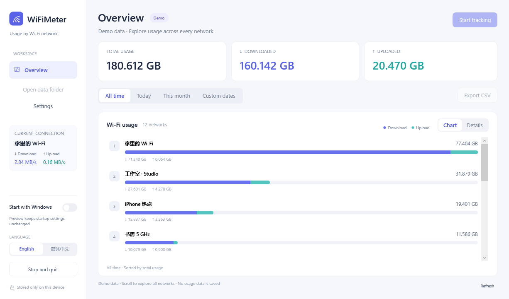

<p align="center">
  <a href="docs/assets/logo.svg"></a>
</p>

<p align="center">
  <a href="https://github.com/chronicle12345/WiFiMeter/releases"></a>
  <a href="#quick-start"></a>
  <a href="docs/DEVELOPMENT.md"></a>
</p>

<p align="center">
  <a href="docs/DEVELOPMENT.md"></a>
  <a href="README.zh-CN.md"></a>
  <a href="docs/DEVELOPMENT.md"></a>
</p>

<p align="center">
  <a href="#quick-start">Quick start</a> &nbsp;·&nbsp;
  <a href="docs/USAGE.md">User guide</a> &nbsp;·&nbsp;
  <a href="docs/DEVELOPMENT.md">Development</a> &nbsp;·&nbsp;
  <a href="https://github.com/chronicle12345/WiFiMeter/releases">Releases</a>
</p>

<p align="center"><strong>English</strong> &nbsp;|&nbsp; <a href="README.zh-CN.md">简体中文</a></p>

WiFiMeter is a Windows desktop app for tracking traffic by Wi-Fi network. It includes date-range reports, application usage, per-network limits and CSV export.



## Quick start

Build on Windows 10 or 11 with Windows PowerShell 5.1 and .NET Framework 4.7.2 or later. With Git installed, run these commands in PowerShell:

```powershell
git clone https://github.com/chronicle12345/WiFiMeter.git
cd WiFiMeter
powershell.exe -NoProfile -ExecutionPolicy Bypass -File .\tools\Build.ps1
Start-Process .\dist\WiFiMeter\WiFiMeter.exe
```

The build uses the C# compiler included with .NET Framework and does not download dependencies. For a preview with demo data:

```powershell
Start-Process .\dist\WiFiMeter\WiFiMeter.exe -ArgumentList '--preview'
```

## Features

- View every recorded Wi-Fi network for today, this month, all retained history, or dates selected in a calendar dialog.
- Give networks display names and set daily, monthly or cumulative traffic limits, with warnings and optional disconnection.
- Open a network to inspect Windows application usage, including a daily breakdown.
- Set history retention, minimize to the system tray, and manage login startup in the app or Task Manager.
- Switch between English and Simplified Chinese and export the selected range to CSV.

Application figures come from Windows and may arrive later than adapter totals. See the [user guide](docs/USAGE.md#application-usage) for the history limits and accounting differences.

## Project layout

```text
src/          Metering modules, WPF interface and native executable host
installer/    Per-user installer and uninstaller
tests/        Unit, interface and integration tests
tools/        Build scripts and icon generation
docs/         User and developer documentation
dist/         Generated executables and ZIP, ignored by Git
```

## Tests

Build first, then run:

```powershell
powershell.exe -NoProfile -STA -ExecutionPolicy Bypass -File .\tests\Run-All.ps1
```

Tests cover accounting, quota rules, retention, application queries, tray lifecycle and installation. Registry tests use isolated keys; they need permission to write to the current user's registry.

[Development](docs/DEVELOPMENT.md) explains the modules and storage format. [User guide](docs/USAGE.md) covers installation and daily use.
