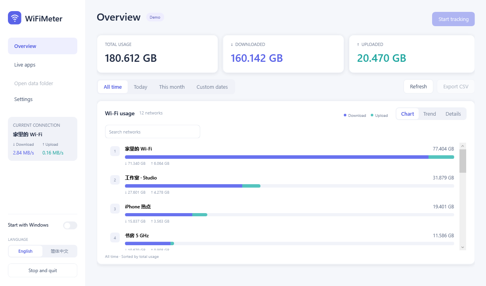
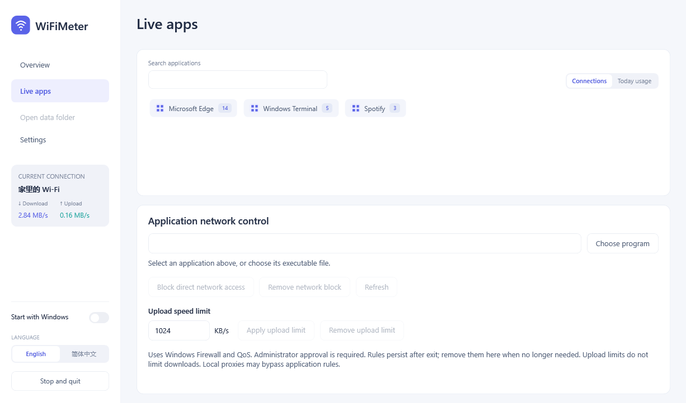

<p align="center">
  <a href="docs/assets/logo.svg"></a>
</p>

<p align="center">
  <a href="https://github.com/chronicle12345/WiFiMeter/releases/tag/v1.1.0"></a>
  <a href="#quick-start"></a>
  <a href="docs/DEVELOPMENT.md"></a>
  <a href="LICENSE"></a>
</p>

<p align="center">
  <a href="docs/DEVELOPMENT.md"></a>
  <a href="README.zh-CN.md"></a>
  <a href="docs/DEVELOPMENT.md"></a>
</p>

<p align="center">
  <a href="#quick-start">Quick start</a> &nbsp;·&nbsp;
  <a href="docs/USAGE.md">User guide</a> &nbsp;·&nbsp;
  <a href="docs/DEVELOPMENT.md">Development</a> &nbsp;·&nbsp;
  <a href="https://github.com/chronicle12345/WiFiMeter/releases/tag/v1.1.0">Releases</a>
</p>

<p align="center"><strong>English</strong> &nbsp;|&nbsp; <a href="README.zh-CN.md">简体中文</a></p>

WiFiMeter is a Windows desktop app for tracking traffic by Wi-Fi network. It includes date-range reports, a dedicated Live apps page, application history, traffic quotas and CSV export. It also offers direct network blocking and upload limits for selected applications.

Overview with demo data:



Live apps page with demo data:



## Quick start

Download `WiFiMeter-Setup.exe` from [Release v1.1.0](https://github.com/chronicle12345/WiFiMeter/releases/tag/v1.1.0) for the recommended installation, then open WiFiMeter from the desktop or Start menu. For a portable copy, extract `WiFiMeter-Portable.zip` and open `WiFiMeter.exe`. See the [installation guide](docs/USAGE.md#install-and-open) for requirements and the unsigned-installer prompt.

### Build from source

Build on Windows 10 or 11 with Windows PowerShell 5.1 and .NET Framework 4.7.2 or later. With Git installed, run these commands in PowerShell:

```powershell
git clone https://github.com/chronicle12345/WiFiMeter.git
cd WiFiMeter
powershell.exe -NoProfile -ExecutionPolicy Bypass -File .\tools\Build.ps1
Start-Process .\dist\WiFiMeter\WiFiMeter.exe
```

The build uses the C# compiler included with .NET Framework and does not download dependencies. For a preview with demo data:

```powershell
Start-Process .\dist\WiFiMeter\WiFiMeter.exe -ArgumentList '--preview'
```

## Features

- View recorded Wi-Fi and wired networks for today, this month, all retained history, or custom dates. Search networks by name or SSID.
- Inspect daily trends across all networks in the selected date range; hover to see the date, download, upload and total usage. Network search does not filter the trend.
- Open the dedicated Live apps page from the sidebar and search programs. Connection counts indicate activity; they are not real-time byte rates. Today's application usage comes from delayed Windows records.
- Open a network's application history, search application names, and filter totals and daily details by date.
- Enter only the local proxy's listening TCP port, such as `7890`, in Settings for automatic process detection; multiple ports are comma-separated, and process names are optional advanced settings.
- Select a program or its executable to block direct network access through Windows Firewall or set an upload limit through Windows QoS. Upload limits use decimal KB/s (1,000 bytes/s) and do not limit downloads.
- Give networks display names, set per-network and total Wi-Fi quotas with warnings and optional disconnection, and export the selected date range to CSV.
- Set history retention, minimize to the system tray, manage login startup, and switch between English and Simplified Chinese.

Application history can differ from adapter totals and is limited to available Windows records within the last 60 days and the tracking/retention period. Proxy attribution estimates each application's share from observed TCP connections; it can miss short connections and does not cover UDP or QUIC. See [application usage and proxy limitations](docs/USAGE.md#application-usage).

Network controls require administrator approval. Local proxy connections and proxy-forwarded traffic may bypass application rules. Rules persist after exit or restart and may remain after uninstall; remove blocks and upload limits before uninstalling. See [permissions, rule persistence and control limitations](docs/USAGE.md#application-network-control).

## Project layout

```text
src/          Metering modules, WPF interface and native executable host
installer/    Per-user installer and uninstaller
tests/        Unit, interface and integration tests
tools/        Build scripts and icon generation
docs/         User and developer documentation
dist/         Generated executables and ZIP, ignored by Git
```

## Tests

Build first, then run:

```powershell
powershell.exe -NoProfile -STA -ExecutionPolicy Bypass -File .\tests\Run-All.ps1
```

Tests cover accounting, quota rules, retention, application queries, tray lifecycle and installation. Registry tests use isolated keys; they need permission to write to the current user's registry.

[Development](docs/DEVELOPMENT.md) explains the modules and storage format. [User guide](docs/USAGE.md) covers installation and daily use.

## License

Licensed under the [MIT License](LICENSE).
