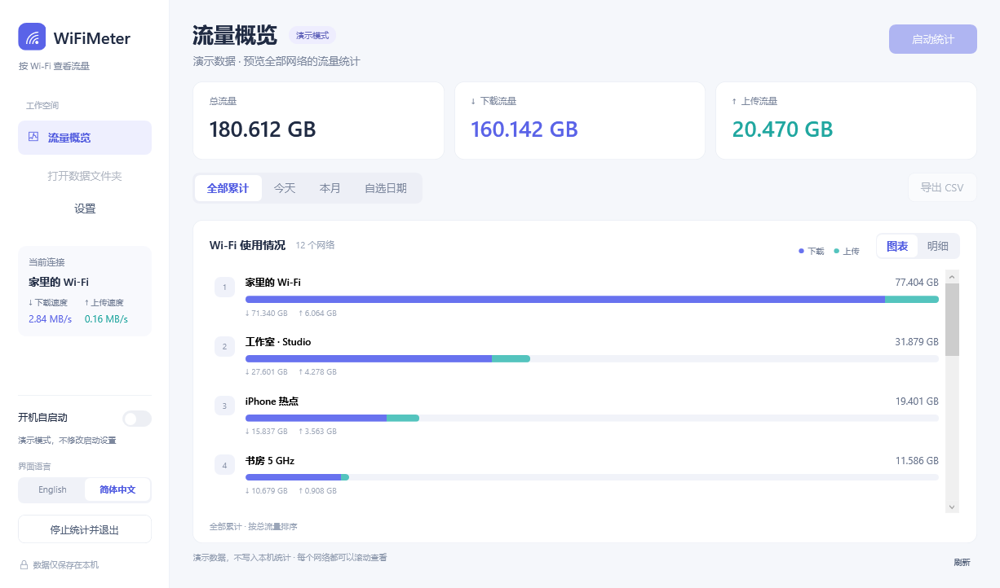

<p align="center">
  <a href="docs/assets/logo.svg"></a>
</p>

<p align="center">
  <a href="https://github.com/chronicle12345/WiFiMeter/releases"></a>
  <a href="#快速运行"></a>
  <a href="docs/DEVELOPMENT.zh-CN.md"></a>
</p>

<p align="center">
  <a href="docs/DEVELOPMENT.zh-CN.md"></a>
  <a href="README.md"></a>
  <a href="docs/DEVELOPMENT.zh-CN.md"></a>
</p>

<p align="center">
  <a href="#快速运行">快速运行</a> &nbsp;·&nbsp;
  <a href="docs/USAGE.zh-CN.md">使用指南</a> &nbsp;·&nbsp;
  <a href="docs/DEVELOPMENT.zh-CN.md">开发说明</a> &nbsp;·&nbsp;
  <a href="https://github.com/chronicle12345/WiFiMeter/releases">版本下载</a>
</p>

<p align="center"><a href="README.md">English</a> &nbsp;|&nbsp; <strong>简体中文</strong></p>

WiFiMeter 是按 Wi-Fi 名称统计流量的 Windows 桌面应用，支持日期范围查询、应用流量明细、网络额度和 CSV 导出。



## 快速运行

构建需要 Windows 10/11、Windows PowerShell 5.1 和 .NET Framework 4.7.2 或更新版本。安装 Git 后，在 PowerShell 中执行：

```powershell
git clone https://github.com/chronicle12345/WiFiMeter.git
cd WiFiMeter
powershell.exe -NoProfile -ExecutionPolicy Bypass -File .\tools\Build.ps1
Start-Process .\dist\WiFiMeter\WiFiMeter.exe
```

构建使用 .NET Framework 自带的 C# 编译器，无需下载依赖。使用演示数据预览界面：

```powershell
Start-Process .\dist\WiFiMeter\WiFiMeter.exe -ArgumentList '--preview'
```

## 功能

- 查看全部 Wi-Fi，支持今天、本月、保留的全部记录，以及日历弹窗中选择的日期范围。
- 设置网络备注、每日或每月额度、累计额度、提醒阈值，以及达到额度后自动断开。
- 点击网络查看 Windows 提供的应用流量，并按天查看明细。
- 设置记录保存时间，最小化到系统托盘，在软件或任务管理器中管理自启动。
- 切换中英文界面，将当前日期范围导出为 CSV。

应用统计由 Windows 提供，更新可能晚于网卡总流量。历史范围和统计差异见[使用指南](docs/USAGE.zh-CN.md#应用流量)。

## 项目结构

```text
src/          统计模块、WPF 界面与原生 EXE 宿主
installer/    当前用户安装器与卸载器
tests/        功能、界面与集成测试
tools/        构建脚本与图标生成
docs/         使用与开发文档
dist/         构建生成的 EXE 和 ZIP，不提交 Git
```

## 测试

构建完成后运行：

```powershell
powershell.exe -NoProfile -STA -ExecutionPolicy Bypass -File .\tests\Run-All.ps1
```

测试覆盖流量累计、额度、记录清理、应用查询、托盘生命周期和安装。注册表测试使用独立测试项，运行环境需允许当前用户写入注册表。

[开发说明](docs/DEVELOPMENT.zh-CN.md)介绍模块和存储格式，[使用指南](docs/USAGE.zh-CN.md)介绍安装与日常操作。
