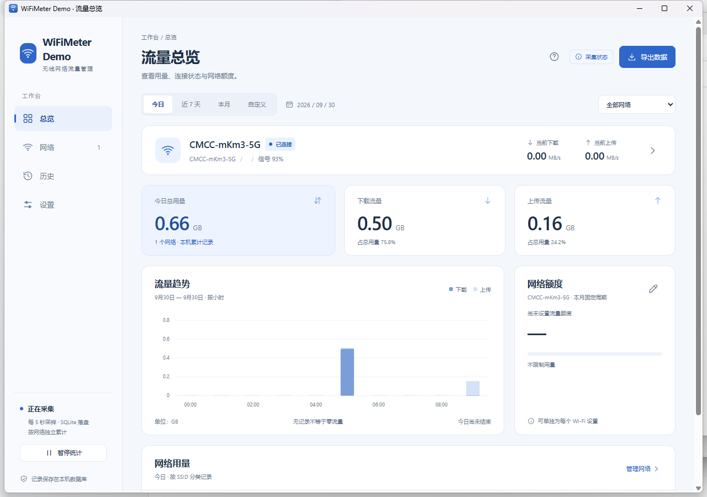

# WiFiMeter

[English](README.md) | 简体中文

<p align="center">
  
</p>

按 Wi-Fi 网络分别统计流量的桌面工具，Linux 与 Windows 共用同一套界面与后端。
数据全部留在本机：后端读取网卡计数器、把流量归属到具体网络，再把历史、额度与偏好
写进本机 SQLite 数据库，不联网、不需要账号。

## 它解决什么问题

路由器只看得到整条宽带的总量，运营商账单更是只有一个数字。想知道「这个月的流量是谁用掉的」，
通常只能靠猜。WiFiMeter 换个做法：**按 Wi-Fi 网络分别记账**。

- 连接 A 网络期间产生的流量只记在 A 名下，换到 B 之后从新的基线重新开始；
- 不知道归属的区间（比如刚断线、还没识别出网络）单独记为缺失，**不硬塞给上一个网络**；
- 每个网络可以单独设额度、单独设提醒阈值，超额的网络可以自动断开（默认只提醒）。

## 功能

**采集**

- 按 2 / 5 / 10 秒间隔读取网卡计数器，实时显示当前网络的下载与上传速率；
- Linux 读 `/proc/net/dev` 并用 `nmcli` 取网络身份；
  Windows 用 WLAN API 取身份、IP Helper API 取计数，两侧按网卡别名对应同一张网卡；
- 采样迟于预期（例如系统休眠）时记录区间缺失，界面明确显示，不当作零流量；
- 可随时暂停统计，暂停期间历史记录仍然可看。

**总览**

- 当前连接卡片：网络名（优先显示备注）、SSID、频段、信号强度、实时速率；
- 所选区间的总用量、下载、上传，以及各占比例；
- 流量趋势图（今日按小时、其他区间按日）；
- 当前网络的额度进度与剩余；
- 网络用量列表，按用量 / 名称 / 已连接优先排序。

**网络**

- 每个网络一行：下载、上传、总用量、额度进度、是否已连接；
- 可为网络添加备注（原始 SSID 不会被修改，只是多一个更好认的名字）；
- 详情页按网络查看趋势与最近记录，并单独设置该网络的额度。

**历史**

- 按天汇总，分页浏览（每页 10 天），显示区间总量与日均；
- 可搜索、可筛选、可导出当前筛选范围。

**额度与提醒**

- 每个网络独立设置额度上限、提醒阈值（默认 80%）、周期（每自然月 / 每天）；
- 达到阈值弹出系统通知；系统提醒总开关可一次关掉所有通知；
- 「达到额度后自动断开」默认关闭，需要在网络详情里明确开启；开启后后端会先核对该
  网卡确实关联着这个网络才断开，并复核断开结果——断不掉会如实报告，不会谎报成功。

**数据**

- 流量导出 CSV / JSON：CSV 带 UTF-8 BOM（Excel 直接打开不乱码），
  单元格做了公式注入转义；导出的是所选区间的原始字节数；
- 完整备份 / 恢复：包含记录、备注、额度与偏好，带格式标记，不会把流量导出文件
  误当成备份；恢复后自动暂停采集，避免当前计数差立刻覆盖刚恢复的历史；
- 历史保留时长可设（30 / 90 / 365 天或长期）；缩短保留期前会确认并提示先备份；
- 清空记录只清用量，保留网络备注与偏好。

**系统集成**

- 开机启动、关闭窗口最小化到托盘、额度提醒转系统通知；
- 界面为中文，网卡名、SSID、备注都按 UTF-8 处理，中文与 emoji 都不会乱码。

## 安装使用

### Windows

从 [Releases](https://github.com/shw940/WiFiMeter/releases) 下载 `WiFiMeter-Demo-1.0.0-x64-Setup.exe` 运行安装向导。
安装包未签名，SmartScreen 可能提示「未知发布者」，选择「更多信息 → 仍要运行」。

- 安装目录：`%LOCALAPPDATA%\Programs\WiFiMeter Demo`
- 数据目录：`%APPDATA%\WiFiMeter Demo`（数据库 `wifimeter.db`），卸载时保留
- 与旧版 WPF 应用使用不同的名称、安装目录与数据目录，可以并存

### Linux

```bash
sudo apt install ./dist/linux/WiFiMeter-1.0.0-linux-amd64.deb
```

安装后从应用菜单打开，或运行 `wifimeter`。包依赖 `libsqlite3-0`。
卸载：`sudo apt remove wifimeter-linux`。

### 首次使用

1. 连上 Wi-Fi，等第一个采样周期（默认 5 秒）；
2. 总览页出现当前网络与实时速率，说明采集正常；
3. 在「网络」里给这个 Wi-Fi 加个备注，方便以后认；
4. 需要限额就在该网络详情里设额度与提醒阈值；
5. 用一会儿之后从「历史」看趋势，或点「导出数据」保存记录。

看不到数据时点右上角「采集状态」，那里会说明采集器、网卡与区间缺失的具体情况。

## 从源码运行

需要 Node.js 22.12 或更新版本、npm 与图形桌面；构建后端还需要 CMake、支持 C++20
的编译器与 SQLite 开发头文件。首次安装依赖以及下载 Electron 需要联网，
**应用本身运行时不需要网络**。

```bash
npm ci --prefix apps/desktop
npm start
```

## 测试与打包

```bash
npm test             # 桌面单元测试 + 界面测试
npm run test:unit    # 数据、文件操作与产品身份的单元测试
npm run test:ui      # Playwright 驱动真实 Electron 与真实后端
npm run test:backend # C++ 后端：构建并运行全部 ctest 目标
npm run test:windows # 交叉编译 Windows 测试目标并用 Wine 运行
npm run dist:linux   # 构建 deb
npm run dist:windows # 构建 NSIS 安装包（Windows 本机或 Linux 交叉编译）
```

界面测试需要图形会话，使用临时用户数据目录，用假的网卡数据驱动真实后端，
**不会改动机器的网络状态**。`npm run dist:linux` 先构建后端，再把应用与
`wifimeter-backend` 一起打进 deb。

**跨平台测试**：`backend/tests/backend_process_support.h` 是一份两端共用的端到端用例——
真的拉起后端子进程、按协议对话、落库到 SQLite，网卡与计数数据由 `--fake-adapter` /
`--fake-counters` 注入。同一份断言在 Linux、Wine 与 Windows 实机上结果一致。

Windows 上还有两个真机检查脚本：

```powershell
node packaging\windows\acceptance.mjs   # 产物 + 只读自检 + 端到端 + 启动打包后的应用
node packaging\windows\system-check.mjs # 托盘驻留、导出、备份
```

详细的构建、验收与故障排查见 [Windows 打包与验收](packaging/windows/README.md)
和[验收清单](packaging/windows/ACCEPTANCE.md)。

## 目录

```text
apps/desktop/               共享 Electron 应用、桌面接入与测试
backend/                    C++ 后端：平台层、业务规则、SQLite 存储、协议与 wifimeter-backend
backend/platform/linux/     Linux 平台层（/proc/net/dev + nmcli）
backend/platform/win32/     Windows 系统调用（WLAN API + IP Helper）
backend/platform/windows/   Windows 平台层与可在任意平台测试的转换逻辑
backend/third_party/sqlite/ Windows 构建使用的 SQLite 合并源码
contracts/                  数据格式与协议边界
packaging/linux/            Linux deb 打包
packaging/windows/          Windows 本机与交叉打包、验收脚本与清单
docs/                       架构说明与截图
```

依赖与锁文件属于 `apps/desktop/`；根目录 `package.json` 只转发命令，不使用 npm workspace。

## 设计取舍

- **不知道就不猜**：读不到网络身份时，那段流量记为缺失，而不是记到上一个网络。
  宁可显示「有区间没采到」，也不给出看似连续其实错误的历史。
- **失败不静默**：网卡查不动、别名对不上、内核链路与管理器报告矛盾，都会上报具体原因，
  界面显示真实状态而不是「未连接」。
- **超额默认只提醒**：自动断网需要用户明确开启，并且断开前核对网卡身份、断开后复核结果。
- **数据不出本机**：没有账号、没有云同步，数据库就是一个本地文件，卸载默认保留。

## 架构

Electron 主进程拉起 `wifimeter-backend` 子进程，双方按行交换 JSON；页面只通过受限的
preload 接口访问桌面能力与后端。业务规则、存储与协议都在后端，两个平台只提供
「读数据」与「执行断开」两件事，采样时序写在一处共用实现里。

详见[架构说明](docs/ARCHITECTURE.md)与[桌面应用说明](apps/desktop/README.md)。

## 许可证

[MIT](LICENSE)
