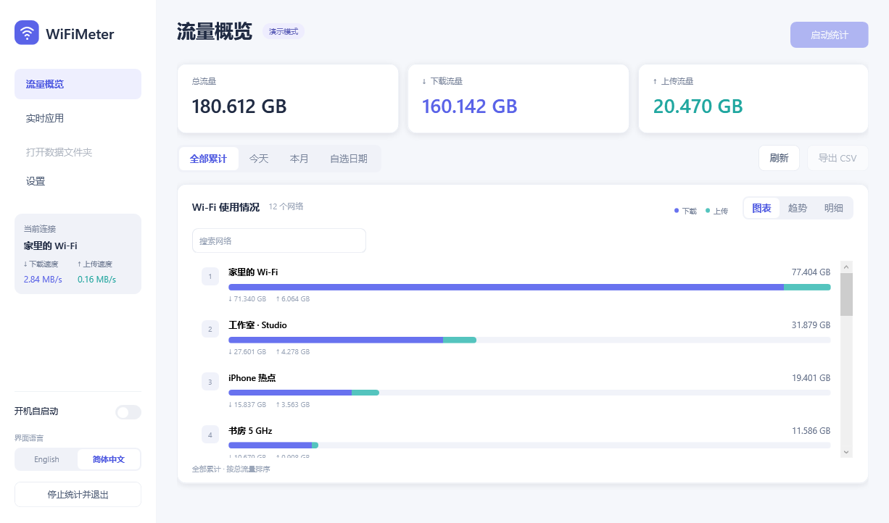
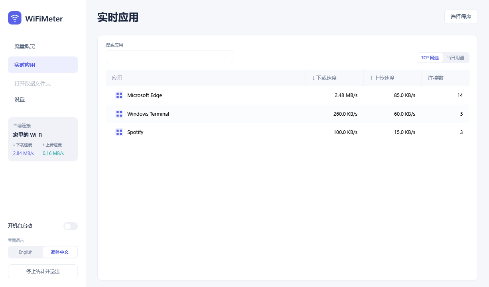

<p align="center">
  <a href="docs/assets/logo.svg"></a>
</p>

<p align="center">
  <a href="https://github.com/chronicle12345/WiFiMeter/releases/tag/v1.1.1"></a>
  <a href="#快速运行"></a>
  <a href="docs/DEVELOPMENT.zh-CN.md"></a>
  <a href="LICENSE"></a>
</p>

<p align="center">
  <a href="docs/DEVELOPMENT.zh-CN.md"></a>
  <a href="README.md"></a>
  <a href="docs/DEVELOPMENT.zh-CN.md"></a>
</p>

<p align="center">
  <a href="#快速运行">快速运行</a> &nbsp;·&nbsp;
  <a href="docs/USAGE.zh-CN.md">使用指南</a> &nbsp;·&nbsp;
  <a href="docs/DEVELOPMENT.zh-CN.md">开发说明</a> &nbsp;·&nbsp;
  <a href="https://github.com/chronicle12345/WiFiMeter/releases/tag/v1.1.1">版本下载</a>
</p>

<p align="center"><a href="README.md">English</a> &nbsp;|&nbsp; <strong>简体中文</strong></p>

WiFiMeter 是按 Wi-Fi 名称统计流量的 Windows 桌面应用，支持日期范围查询、独立的实时应用页面、应用历史、网络额度和 CSV 导出，也可为指定应用设置直接联网阻止和上传限速。

本文介绍 WiFiMeter v1.1.1。2026-10-01 的更新内容见 [v1.1.1 发布说明](docs/releases/v1.1.1.md)，历史版本见[更新日志](CHANGELOG.md)。

概览页面，使用演示数据：



实时应用页面，使用演示数据：



## 快速运行

推荐从 [Release v1.1.1](https://github.com/chronicle12345/WiFiMeter/releases/tag/v1.1.1) 下载 `WiFiMeter-1.1.1-Setup.exe` 安装，然后从桌面或开始菜单打开。需要便携版时，下载并解压 `WiFiMeter-1.1.1-Portable.zip`，双击 `WiFiMeter.exe`。运行要求与未签名安装包提示见[安装说明](docs/USAGE.zh-CN.md#安装和打开)。

### 从源码构建

构建需要 Windows 10/11、Windows PowerShell 5.1 和 .NET Framework 4.7.2 或更新版本。安装 Git 后，在 PowerShell 中执行：

```powershell
git clone https://github.com/chronicle12345/WiFiMeter.git
cd WiFiMeter
powershell.exe -NoProfile -ExecutionPolicy Bypass -File .\tools\Build.ps1
Start-Process .\dist\WiFiMeter\WiFiMeter.exe
```

构建使用 .NET Framework 自带的 C# 编译器，无需下载依赖。使用演示数据预览界面：

```powershell
Start-Process .\dist\WiFiMeter\WiFiMeter.exe -ArgumentList '--preview'
```

## 功能

- 查看已记录的 Wi-Fi 与有线网络，支持今天、本月、保留的全部记录和自选日期，并按网络名称或 SSID 搜索。
- 查看所选日期范围内全部网络的每日趋势，鼠标悬停可查看日期、下载、上传和总流量；网络搜索不筛选趋势数据。
- 从侧边栏进入实时应用页面，以表格查看并搜索各应用的 TCP 下载、上传速度和连接数。速率不可用时显示横线，点击应用后显示网络控制；当日用量来自可能延迟的 Windows 记录。
- 打开网络的应用历史，选择包含起止当天的日期范围，按应用名称搜索；可在具体日期明细与按应用、月份汇总之间切换，CSV 导出保留当前表格的搜索、汇总和排序结果。
- 在设置中只填写本地代理监听的 TCP 端口，例如 `7890`，即可自动识别代理进程；多个端口用逗号分隔，进程名可在高级选项中补充。
- 选择程序或其可执行文件，通过 Windows 防火墙阻止直接联网，或通过 Windows QoS 设置上传限速。限速单位为 KB/s（1000 字节/秒），仅限制上传，不限制下载。
- 设置网络备注、单个网络额度和 Wi-Fi 总额度，支持提醒及达到额度后自动断开，并将所选日期范围导出为 CSV。
- 设置记录保存时间，最小化到系统托盘，管理自启动，并切换中英文界面。

TCP 网速通过 Windows TCP EStats 获取，后台每秒采样一次，需要管理员权限。同一 AppId 的进程合并显示；环回和代理的各条连接独立计数，不包含 UDP、QUIC，可能漏掉短连接或断开前的末尾流量。详见 [TCP 网速](docs/USAGE.zh-CN.md#tcp-网速)。

应用历史可能与网卡总流量不同，仅覆盖最近 60 天内且处于统计和保留期限内的可用 Windows 记录。代理归属按观测到的 TCP 连接数估算，可能漏采短连接，不覆盖 UDP 和 QUIC。详见[应用流量与代理统计限制](docs/USAGE.zh-CN.md#应用流量)。

应用网络控制需要管理员授权。本地代理连接及代理转发的流量可能不受应用规则控制。规则会在退出或重启后保留，卸载后也可能残留；卸载前请恢复联网并取消上传限速。详见[权限、规则持久性与控制限制](docs/USAGE.zh-CN.md#应用网络控制)。

## 项目结构

```text
src/          统计模块、WPF 界面与原生 EXE 宿主
installer/    当前用户安装器与卸载器
tests/        功能、界面与集成测试
tools/        构建脚本与图标生成
docs/         使用与开发文档
dist/         构建生成的 EXE 和 ZIP，不提交 Git
```

## 测试

构建完成后运行：

```powershell
powershell.exe -NoProfile -STA -ExecutionPolicy Bypass -File .\tests\Run-All.ps1
```

测试覆盖流量累计、额度、记录清理、应用查询、托盘生命周期和安装。注册表测试使用独立测试项，运行环境需允许当前用户写入注册表。

[开发说明](docs/DEVELOPMENT.zh-CN.md)介绍模块和存储格式，[使用指南](docs/USAGE.zh-CN.md)介绍安装与日常操作。

## 许可证

本项目采用 [MIT 许可证](LICENSE)。
