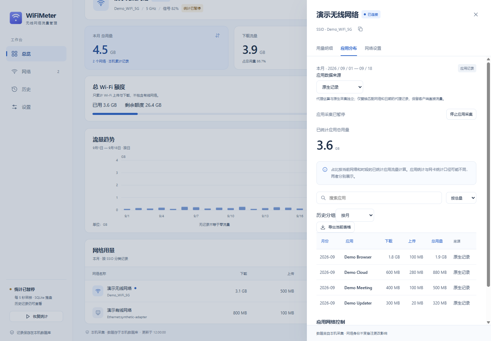

<p align="center">
  <a href="docs/assets/logo.svg"></a>
</p>

<p align="center">
  <a href="docs/releases/v1.2.2.md"></a>
  <a href="docs/PACKAGING-MATRIX.md"></a>
  <a href="backend/README.md"></a>
  <a href="LICENSE"></a>
</p>

<p align="center">
  <a href="apps/desktop/README.md"></a>
  <a href="docs/MIGRATION.md"></a>
  <a href="README.md"></a>
</p>

<p align="center">
  <a href="#构建与测试">构建与测试</a> &nbsp;·&nbsp;
  <a href="docs/MIGRATION.md">数据迁移</a> &nbsp;·&nbsp;
  <a href="docs/PACKAGING-MATRIX.md">平台与安装包</a> &nbsp;·&nbsp;
  <a href="https://github.com/chronicle12345/WiFiMeter/releases">版本下载</a>
</p>

<p align="center"><a href="README.md">English</a> &nbsp;|&nbsp; <strong>简体中文</strong></p>

适用于 Windows 和 Linux 的桌面流量统计工具。界面使用 Tauri，采样、计数和存储由 C++ 后端处理，历史记录保存在本机 SQLite 数据库中。当前源码目标版本为 1.2.2，已发布安装包见[版本下载](https://github.com/chronicle12345/WiFiMeter/releases)。

以下总览和应用历史截图均使用虚构数据。




## 功能

- 统计 Wi-Fi 和物理有线网卡流量，显示实时下载、上传速度，支持网络备注与历史搜索。有线统计排除虚拟网卡。
- 使用 Windows ETW 或 Linux eBPF 采集应用流量，显示权限和缺失状态。应用历史支持按日、按月汇总，并导出当前筛选结果。
- 支持单网络额度和独立的 Wi-Fi 总额度，周期可选每日、每月或累计。有线流量不计入 Wi-Fi 总额度，可设置提醒及达到额度后断开 Wi-Fi。
- Windows 支持按应用禁止联网和上传限速，选择应用或可执行文件后显示控制项。上传限速不限制下载，Linux 暂不提供这些控制。
- Windows 支持可选的代理流量估算，与原生记录分开显示。估算依据已观测的 TCP 连接，证据不足的部分保留为未归属流量。
- 支持包含起止当天的自选日期、全部历史查询、CSV/JSON 导出、完整备份、保存天数、中英切换、托盘和开机启动。
- 「设置 → 数据与存储」可更改数据库所在文件夹：切换时先停止采集器，把当前 `wifimeter.db` 复制到所选文件夹，并保留原文件。目标文件夹已有数据库时不会覆盖，可选择使用该数据库，或先把它归档为 `wifimeter.db.replaced-<UTC 时间戳>` 再用当前数据替换。自定义文件夹之后不可用时，下次启动会询问重新选择位置，或本次运行改用默认位置。

## 原有数据与升级

Windows 会发现旧文件版的默认目录 `%LOCALAPPDATA%\WiFiMeter\data`，其他目录可在设置中选择。导入前需要停止旧采集器；Windows 安装程序会先请求旧采集器保存并退出，再替换程序。

迁移保留原文件，先生成恢复备份，再用数据库事务导入符合条件的记录。重复导入同一份数据不会再次累计流量。遇到冲突会拒绝导入，不会直接覆盖现有数据库。无法确定归属的应用缓存，以及不能精确转换的旧设置，会保留原文并列在导入报告中。

已有跨平台 SQLite 配置目录保持不变。Windows 继续使用 `%APPDATA%\WiFiMeter Demo\wifimeter.db`，以便读取之前的数据；Linux 沿用 `$XDG_CONFIG_HOME/WiFiMeter`（默认 `~/.config/WiFiMeter`）。自定义位置记录在该配置目录的 `data-location.json` 中，偏好设置、迁移备份、更新下载和 WebView 数据仍留在默认位置。卸载不会删除这些数据目录。

恢复方法、原文件保留方式和备份范围见[迁移说明](docs/MIGRATION.md)。原文件版 [v1.1.1](https://github.com/chronicle12345/WiFiMeter/releases/tag/v1.1.1) 仍可下载。

## 安装包

全部打包在 Linux 完成：Windows x64 提供 NSIS 安装器和便携 ZIP，Linux x64/ARM64 默认提供 deb。Windows 和 Linux x64 已有本地构建验证；ARM64、rpm/AppImage 的验证范围及系统兼容性见[构建与验证矩阵](docs/PACKAGING-MATRIX.md)。Windows 使用系统 WebView2，Linux 使用 GTK/WebKit。

应用采集需要系统支持和相应权限。Linux eBPF 另有内核要求，详见 [Linux 采集](docs/LINUX_APP_CAPTURE.md)及 [Windows 采集](docs/WINDOWS_APP_CAPTURE.md)。应用网络控制会请求管理员授权。防火墙和 QoS 规则可能在退出或卸载后保留，不再需要时请先在应用内移除。

## 构建与测试

安装 Node.js 24、Rust、CMake、C++20 编译器及[平台依赖](packaging/README.md)后运行：

```sh
npm ci --prefix apps/desktop
npm run build:backend
npm --prefix apps/desktop exec -- playwright install chromium
npm run test:unit
npm run test:rust
npm run test:ui
```

后端测试由 CMake 构建，通过 CTest 执行。平台依赖及打包命令见[打包说明](packaging/README.md)：

```sh
./packaging/build-windows.sh
./packaging/build-linux.sh
./packaging/build-all.sh
```

测试使用虚构数据和隔离目录。构建产物、运行数据、日志与本机凭据不提交 Git。发布流程仅在相应架构、迁移、后端、界面和安装包检查通过后发布标签对应的版本。

## 性能与许可

采样、计数和存储放在原生后端；界面按所选日期查询，避免反复加载全部历史。不重复写入未变的自启动设置，连续缺失区间合并保存，大型 IPC 消息按新增分段扫描。Tauri 安装包不捆绑浏览器运行时，包大小显著缩小；运行内存仍包含系统 WebView 进程，不能仅凭安装包变小推断内存降低。实测范围见[打包说明](packaging/README.md)。

应用采用 [MIT 许可证](LICENSE)。第三方组件及 Linux BPF 程序的独立许可见[第三方说明](backend/third_party/README.md)。
